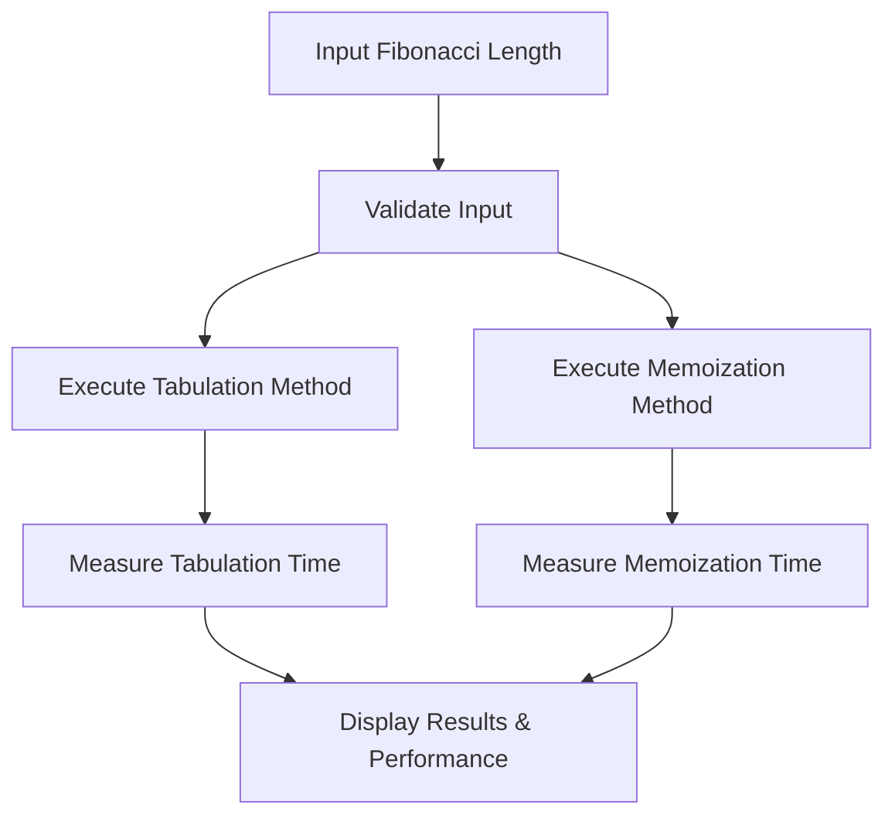

## 1. Product Overview
A React/TypeScript application that visualizes and compares the performance of Fibonacci sequence generation using Tabulation (bottom-up dynamic programming) versus Memoization (top-down with caching) techniques. The app helps developers understand algorithmic efficiency differences through real-time performance measurements.

Target users include computer science students, algorithm learners, and developers seeking to understand dynamic programming optimization techniques.

## 2. Core Features

### 2.1 User Roles
No user roles required - this is a public educational tool requiring no authentication.

### 2.2 Feature Module
Our Fibonacci comparison application consists of the following main pages:
1. **Main Comparison Page**: input field, algorithm selection, performance visualization, results display.

### 2.3 Page Details
| Page Name | Module Name | Feature description |
|-----------|-------------|---------------------|
| Main Comparison Page | Input Section | Accept non-negative integer input for Fibonacci sequence length with validation |
| Main Comparison Page | Algorithm Execution | Generate Fibonacci series using both Tabulation and Memoization methods simultaneously |
| Main Comparison Page | Performance Metrics | Measure and display execution time for both algorithms with high precision |
| Main Comparison Page | Results Display | Show generated sequences and performance comparison with visual indicators |
| Main Comparison Page | Visual Comparison | Display side-by-side results with performance difference highlighting |

## 3. Core Process
Users enter a non-negative integer representing the Fibonacci sequence length. The application automatically generates the sequence using both Tabulation and Memoization techniques, measures execution time for each method, and displays the results with performance metrics. Users can compare execution speeds and understand the efficiency differences between the two approaches.

## 4. User Interface Design

### 4.1 Design Style
- Primary color: #2563eb (blue) for headers and primary actions
- Secondary color: #10b981 (green) for success indicators
- Error color: #ef4444 (red) for validation errors
- Button style: Rounded corners with hover effects
- Font: Inter, 16px base size with responsive scaling
- Layout: Card-based with clean separation between input, execution, and results sections
- Icons: Lucide React icons for clarity and modern appearance

### 4.2 Page Design Overview
| Page Name | Module Name | UI Elements |
|-----------|-------------|-------------|
| Main Comparison Page | Input Section | Centered input field with number validation, clear placeholder text, and submit button |
| Main Comparison Page | Results Display | Two-column layout showing Tabulation and Memoization results with execution times |
| Main Comparison Page | Performance Metrics | Bar chart or numerical comparison highlighting the faster algorithm |

### 4.3 Responsiveness
Desktop-first design with mobile responsiveness. The layout adapts from two-column (desktop) to single-column (mobile) for optimal viewing on all devices.

### 4.4 3D Scene Guidance
Not applicable - this is a 2D data visualization application.