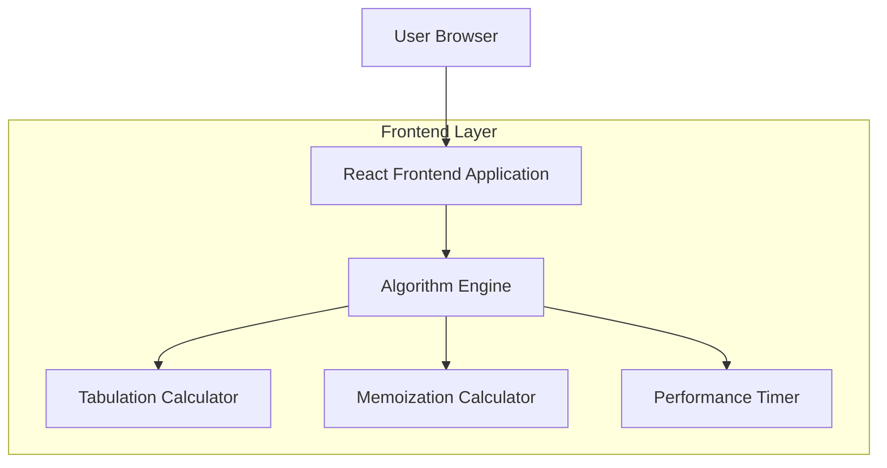

## 1. Architecture Design



## 2. Technology Description
- Frontend: React@18 + TypeScript@5 + TailwindCSS@3 + Vite
- Initialization Tool: vite-init
- Backend: None (client-side only application)
- Additional Dependencies: lucide-react for icons

## 3. Route Definitions
| Route | Purpose |
|-------|---------|
| / | Main comparison page - Fibonacci algorithm comparison tool |

## 4. API Definitions
No backend APIs required - all calculations performed client-side.

## 5. Server Architecture Diagram
Not applicable - this is a client-side only application with no server components.

## 6. Data Model
Not applicable - no persistent data storage required.

## 7. TypeScript Type Definitions
```typescript
// Algorithm performance metrics
interface PerformanceResult {
  algorithm: 'tabulation' | 'memoization';
  executionTime: number; // in milliseconds
  sequence: number[];
  inputSize: number;
}

// Main comparison result
interface ComparisonResult {
  tabulation: PerformanceResult;
  memoization: PerformanceResult;
  fasterAlgorithm: 'tabulation' | 'memoization' | 'tie';
  performanceRatio: number;
}

// Input validation
interface InputValidation {
  isValid: boolean;
  error?: string;
  value?: number;
}
```

## 8. Algorithm Implementation Details

### Tabulation Implementation
```typescript
function fibonacciTabulation(n: number): number[] {
  if (n < 0) return [];
  if (n === 0) return [0];
  
  const dp: number[] = new Array(n + 1);
  dp[0] = 0;
  dp[1] = 1;
  
  for (let i = 2; i <= n; i++) {
    dp[i] = dp[i - 1] + dp[i - 2];
  }
  
  return dp;
}
```

### Memoization Implementation
```typescript
function fibonacciMemoization(n: number): number[] {
  const memo: Map<number, number> = new Map();
  
  function fib(n: number): number {
    if (n <= 1) return n;
    if (memo.has(n)) return memo.get(n)!;
    
    const result = fib(n - 1) + fib(n - 2);
    memo.set(n, result);
    return result;
  }
  
  const result: number[] = [];
  for (let i = 0; i <= n; i++) {
    result.push(fib(i));
  }
  
  return result;
}
```

## 9. Performance Measurement
```typescript
function measurePerformance(
  fn: (n: number) => number[],
  n: number
): PerformanceResult {
  const start = performance.now();
  const sequence = fn(n);
  const end = performance.now();
  
  return {
    algorithm: fn.name.includes('tabulation') ? 'tabulation' : 'memoization',
    executionTime: end - start,
    sequence,
    inputSize: n
  };
}
```

## 10. .bat Launcher Configuration
Create `launch.bat` file:
```batch
@echo off
echo Starting Fibonacci Comparison Application...
cd /d "%~dp0"
npm run dev
echo Application launched successfully!
pause
```

This launcher ensures compatibility by:
- Setting the correct working directory
- Running the development server
- Providing user feedback
- Keeping the console window open for debugging